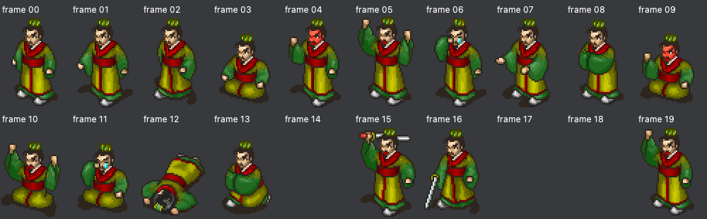
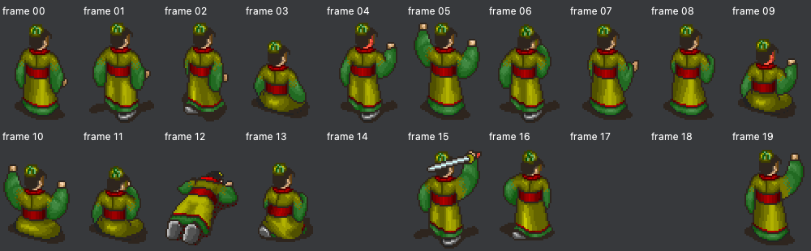

# R 场景动作编号与 Pmapobj 物理帧审计

结论：当前 Godot 播放器将动作 ID 直接作为精灵帧号，遗漏旧引擎查表；动作 1..17 因此全部错取前两帧。资源本身未发现导出错位或像素丢失。后续修复：Godot 的 `r_person.gd` 已按此表修正动作及行走序列，加入独立EXE表测试；下文“当前代码问题”记录的是修复前审计结果，Python预览及编辑器标签不在本次Godot修复范围内。

## 完整对应表

帧号从 0 开始；PNG 从上往下每 64 像素一帧，截图中第 N 行（从1数）对应帧号 N−1。

| EEX 动作 ID | Pmapobj 物理帧号／序列 | 姿态说明 | 原版 R 出场/转向/动作命令使用次数 |
| --- | --- | --- | --- |
| 0 | 0 → 1 → 0 → 2 | 站立／行走 | 4264 |
| 1 | 3 | 跪坐 | 26 |
| 2 | 4 | 脸红／激动 | 164 |
| 3 | 5 | 双手举起 | 384 |
| 4 | 6 | 哭泣 | 8 |
| 5 | 7 | 伸手 | 19 |
| 6 | 8 | 作揖 | 830 |
| 7 | 9 | 跪坐脸红 | 2 |
| 8 | 10 | 跪坐举手 | 7 |
| 9 | 11 | 跪坐哭泣 | 21 |
| 10 | 12 | 倒下 | 15 |
| 11 | 13 | 单膝跪地 | 83 |
| 12 | 14 | 被缚 | 5 |
| 13 | 15 | 挥剑扬起 | 11 |
| 14 | 16 | 挥剑劈下 | 13 |
| 15 | 17 | 活埋 | 1 |
| 16 | 18 | 起身 | 5 |
| 17 | 19 | 单手举起 | 141 |
| 65535 | 保留已有动作 | 不改变动作 | 5 |

动作 0 初始取帧0；移动更新时按 `[0,1,0,2]` 循环。其余动作查表后只有一帧。0 是站立/移动共用动作，不意味着人物静止时自动原地踏步。

表中帧映射来自可执行文件，姿态中文名称来自现有物理帧标签及像素观察，并非从旧引擎导出的官方动作名称。动作13、14是挥剑的两个独立姿态，不应擅自把任一个改成自动连续挥剑。动作15、16等特殊槽并非每名人物都有图。

## 原程序证据

审计对象 `ccz/Ekd5.exe`，SHA-256：
`199b1b67cf966ead46c49b430b9aab84bdc7d4f0e8dfa8e0ebeec5da280b01e0`

- `0x00426871`：将动作 ID 乘9，加 `0x0048B920`，得到动作记录地址。查表核心指令为 `imul eax,eax,9; add eax,0x48b920`。
- `0x0048B920`（文件偏移 `0x0008A320`）：18条动作记录，每条9字节。首字节是序列长度，之后是物理帧号；未使用字节为 FF。
- 动作0原始记录：`04 00 01 00 02 FF FF FF FF`。
- 动作1原始记录：`01 03 FF FF FF FF FF FF FF`。
- 动作6原始记录：`01 08 FF FF FF FF FF FF FF`。
- 动作17原始记录：`01 13 FF FF FF FF FF FF FF`；这里十六进制13即十进制帧19。
- `0x0042A4B0`：查上述记录，保存记录指针至人物结构 `+0x34`，将记录首帧 `record[1]` 写到 `+0x2A`。
- `0x0042A4F5`：推进动画序号，按记录长度回绕，从 `record[1+序号]` 写入当前帧。它由路径推进分支调用，因此行走四相位并非推测。
- `0x0042B010`：实际地址计算为 `sprite_buffer + (方向槽*20 + 当前物理帧)*48*64`。
- `0x00426C6A`：按形象编号乘2读取两个 Pmapobj 块，并构造镜像方向；代码中明确使用20帧、宽48、高64（整列高1280）。
- `0x00428B87`：新动作等于 FFFF 时跳过动作更新，否则调用 `0x0042A4B0`。方向 FFFF 另行保留。

上述函数的反汇编摘录保存在 [engine_evidence.txt](engine_evidence.txt)，全部动作表原始字节、地址和资源检查结果见 [audit.json](audit.json)。

## 资源核对

重新读取本目录原版 `Pmapobj.e5`，解压412块，每块61440字节：48×64×20，合计206套双朝向形象。
用 `Pmpalet.e5` 第0套调色板、索引0透明，还原每块 RGBA，与实际 Godot 工程412张 `assets/sprites/pmapobj/*.png` 逐像素比较：**412/412一致，差异0张**。原始像素最大调色板索引173，处于导出器使用的固定174色区域内。

因此，当前拆分尺寸、纵向帧顺序、PNG导出及所用颜色没有发现问题；这不等于已独立证明通用 LS12 解码器的所有边界情况。当前可见动作错位由独立的可执行文件查表证据直接解释。

曹操形象0的正背两块，其14、17、18号帧均为原始全零透明槽，并非导出丢图。所有形象的空槽清单见 audit.json；不要自动把空帧替换成站立，那会掩盖角色是否支持此姿态的问题。

原始像素帧图（未重绘）：





## 当前代码问题与修正落点

1. `tools/godot_template/scripts/story/r_person.gd::refresh_sprite`：`clampi(action,0,19)` 应改为查动作表；0静止取0，1..17取 `action+2`，FFFF由设置动作接口保留。
2. 同一函数行走目前为1/2交替，应改为 `[0,1,0,2]`。帧节奏仍需与原版计时对照，不能仅凭表推导150毫秒准确性。
3. `r_scene_resources.py::render_person` 也直接使用 `action*3072`；如果参数表示EEX动作ID，预览同样会错。资源编辑器中用于浏览物理帧的编号应继续保留0..19，不能把它一起改成动作ID。
4. `sprite_resources.py::R_FRAME_LABELS` 描述物理帧，原本就不是剧本动作表。需要显式区分“动作ID”与“物理帧号”。
5. `eex_editor.py` 还使用 `{0:站立,1:行走,2:跑步,3:攻击,4:防御,5:倒地,6:起身}` 作为0x34动作摘要。这套标签不适用于本次查明的R动作，不能作为取帧依据。
6. `verify_r_prologue.gd` 目前曾断言动作6取384像素行（帧6）；该测试复制了旧实现的错误假设。修正时应以本次独立提取的表为基准，动作6应取512像素行（帧8）。之前剧情通跑测试只证明执行流程不报错，不能证明姿态语义正确。

复核命令（使用项目虚拟环境）：

```sh
./venv/bin/python tools/audit_r_actions.py
```
