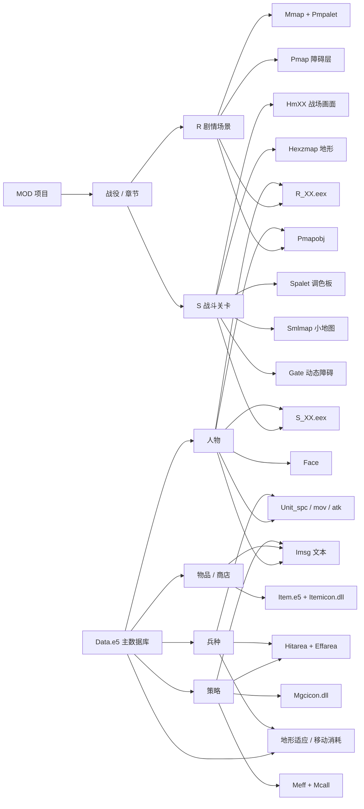
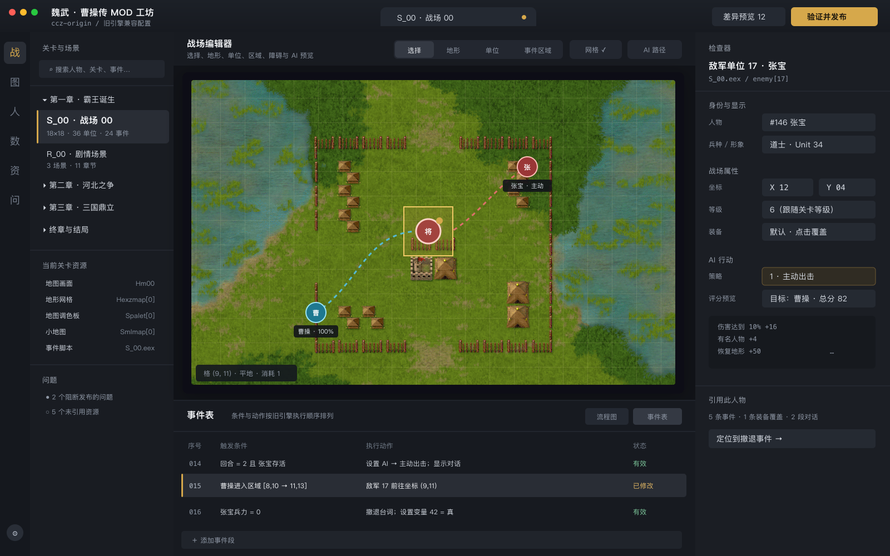
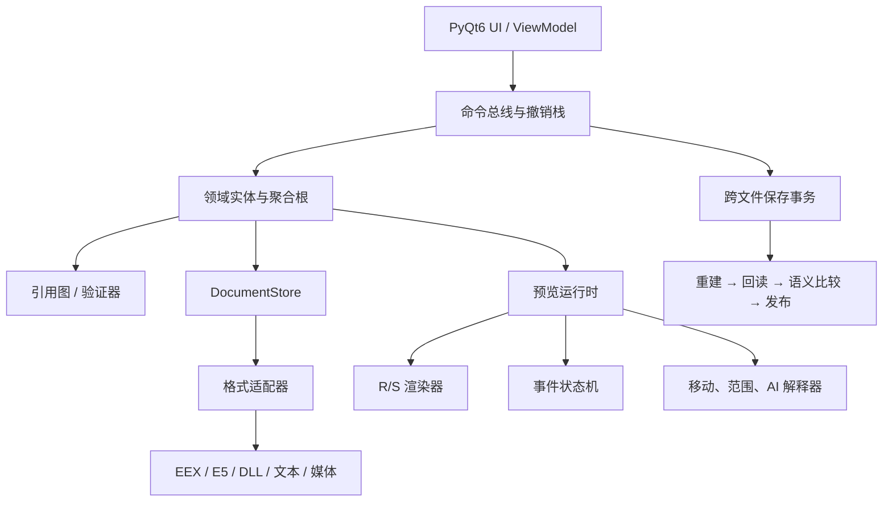

# 曹操传旧引擎全能 MOD 编辑器方案

## 1. 结论

这个工具不应继续发展成“很多文件编辑器的启动器”，而应做成一个以
**项目、关卡和游戏实体**为中心的制作环境：

- 用户编辑的是“人物、物品、策略、R 场景、S 关卡、事件、资源”，不是
  `Data.e5[0]`、`Mmap[70]` 或 `S_12.eex` 中的一段字节；
- 底层维护实体与所有文件位置之间的引用图；
- 中央画布负责场景，右侧检查器负责选中对象，底部事件表负责执行逻辑；
- 所有跨文件修改进入同一事务，保存前统一重建、回读、验证和差异预览；
- 预览运行时明确区分“已由旧引擎核实”“近似模拟”“必须进原游戏测试”
  三种可信度。

技术路线建议继续使用 **Python + PyQt6**。现有解析器和三个编辑器可
直接复用，重写成 Electron、Web 或另一套语言只会延迟核心联动能力。
但底层领域模型必须从 UI 中拆出，保持纯 Python、无 Qt 依赖。

## 2. 产品定位

建议产品名暂定为“魏武 · 曹操传 MOD 工坊”。

它包含六个主要工作台：

1. **战役**：章节、R/S 剧本、关卡顺序和全局问题；
2. **场景**：R 场景背景、障碍、人物、区域和事件；
3. **战场**：S 地图、地形、出场单位、AI、动态障碍和事件；
4. **数据库**：人物、兵种、物品、商店、策略、地形属性和文本；
5. **资源**：头像、R/S 形象、物品图标、策略图标、特效、UI、音视频；
6. **测试与发布**：事件单步、AI 评分预览、验证、差异包和原游戏启动。

存档文件只应作为“调试快照/测试场景”打开，不作为关卡定义的主要编辑
入口。`Ekd5.exe`、补丁 DLL 和未知外部 MOD 也不应在第一版中自动修改。

## 3. 当前代码可复用程度

| 能力 | 当前状态 | 在统一编辑器中的处理 |
| --- | --- | --- |
| EEX 解析、AST、DSL、保真回写 | 已具备 | 作为事件系统核心，不再使用字典式旧模型作为主数据 |
| 战场图与 Hexzmap 地形编辑 | 已具备 | 合并为 S 关卡画布的地图/地形图层 |
| Mmap、Pmap 投影与 R 人物编辑 | 已具备 | 合并为 R 场景画布 |
| Unit 与 Pmapobj 形象浏览/回写 | 已具备 | 作为人物/兵种资源检查器和动画面板 |
| Data.e5 六张业务表 | 字段级读取已具备 | 需要补齐保真构建器、字段约束和跨表校验 |
| Imsg.e5 | 定长记录读取已具备 | 需要补齐安全写入、字节长度提示和引用定位 |
| Item、DLL 图标、Meff/Mcall、Logo 等 | 多数可读取/导出 | 按优先级补齐导入、量化、重建和回读验证 |
| 存档 | 主要字段可读取 | 先只读，用于运行状态检查和测试快照 |
| AI | 调度和部分评分已分析 | 做解释型预览，不在早期宣称完整复刻 |
| 跨文件项目模型 | 尚无 | 第一优先级 |
| 跨文件撤销、事务保存、引用图 | 尚无 | 第一优先级 |

现有独立编辑器中的安全保存逻辑值得保留：临时文件、回读校验、首次备份、
原子替换。但它们必须上移到项目事务层，不能让每个窗口各自保存。

## 4. 游戏实体与文件联动

### 4.1 总体依赖图



### 4.2 人物实体

编辑器中的一个 `Person(id)` 应同时聚合：

- `Data.e5`：名字、头像号、R 形象号、阵营、五维、兵种、等级和装备；
- `Imsg.e5`：人物介绍、列传、撤退台词、暴击台词等；
- `Face.e5`：头像预览；
- `Pmapobj.e5`：R 场景形象；
- `Unit_spc/mov/atk.e5`：战场动作；实际映射需经过人物/兵种形象规则；
- 所有 R/S EEX 中的 `people_id` 引用；
- 存档中的人物实例，仅作为运行状态和测试数据展示。

改人物名字通常只修改 `Data/Imsg`，不需要改 ID。**人物重新编号属于高危
重构**：必须先查完全部 EEX、Data、存档模板和已知资源引用；遇到未知
字节引用时应禁止自动执行。

### 4.3 物品实体

一个 `Item(id)` 聚合：

- `Data.e5` 的属性、价格、效果、图标号；
- `Imsg.e5` 的说明；
- `Item.e5` 的 32×32 图片；
- `Itemicon.dll` 的 16×16/32×32 UI 图标；
- 商店表、人物初始装备、EEX 获得/装备命令中的引用。

交互上允许用户更换一个物品图标时同时预览两种尺寸，但保存时仍把两个
物理文件作为同一事务中的两个文档处理。

### 4.4 策略实体

一个 `Magic(id)` 聚合：

- `Data.e5`：类型、作用目标、攻击范围、效果范围、MP、图标、学习等级；
- `Imsg.e5`：名称说明；
- `Mgcicon.dll`：策略图标；
- `Hitarea.e5`、`Effarea.e5`：范围模板；
- `Meff.e5` 或 `McallXX.e5`：播放效果、步骤和音效；
- EEX 的策略演出引用；
- 旧引擎 AI 用途类别，作为只读诊断或高级覆盖项。

策略编辑页应在同一屏显示“数据、范围、图标、动画、学习兵种和 AI
用途”，否则用户无法判断一次修改的实际效果。

### 4.5 S 战斗关卡

`BattleStage(id)` 是最重要的聚合根：

- `S_XX.eex`：背景选择、战斗初始化、全局变量、出场、装备、AI、天气、
  区域触发、胜败条件和演出；
- `HmXX.e5`：视觉地图；
- `Hexzmap[id]`：宽高和逐格地形；
- `Spalet[id]`：地图调色板；
- `Smlmap[id]`：小地图；
- `Gate.e5`：被本关 `0x58` 指令引用的动态 3×3 画面；
- `Data.e5`：人物、兵种、装备、地形属性；
- Unit/Face/Mark/Weather/范围图：单位和效果预览；
- 音频、文本和视频：事件演出引用。

必须把“视觉地图”和“逻辑地形”显示为两个图层。修改 Hexzmap 不代表
Hm 的地面图案会自动改变；UI 应明确提示两者是否一致，不能制造“改了
地形就自动重画原版地图”的假象。

### 4.6 R 剧情场景

`RScene(id)` 聚合：

- `R_XX.eex` 的背景、人物显示/移动、对话、点击和区域条件；
- `Mmap.e5` 背景；
- `Pmpalet.e5` 调色板；
- 内场景对应的 `Pmap.e5` 二值障碍网格；
- `Pmapobj.e5` 人物动作；
- Face、Imsg 和音乐音效。

画布使用已经确认的 Pmap 投影。背景、障碍、人物脚底、事件区域必须共享
同一个坐标服务，禁止每个图层自行维护偏移常量。

## 5. 统一领域模型

核心模型建议包含以下类型：

```text
Project
├─ CompatibilityProfile
├─ DocumentStore
│  ├─ BinaryDocument
│  ├─ EexDocument
│  └─ MediaDocument
├─ EntityRegistry
│  ├─ Person / Force / Item / Magic / Shop
│  ├─ RScene / BattleStage
│  └─ Asset
├─ ReferenceGraph
├─ ChangeSet
├─ ProblemStore
└─ PreviewState
```

关键抽象：

- `ResourceKey(kind, id)`：例如 `person:146`、`battle:0`；
- `SourceRef(document, block, record, field, byte_span)`：从实体回到物理文件；
- `ReferenceEdge(source, field, target, confidence)`：记录 ID 引用；
- `OpaqueSpan`：保存未知或未使用字节，重建时原样放回；
- `ChangeCommand`：所有编辑操作的可撤销命令；
- `ChangeSet`：一次跨文件业务操作产生的全部修改；
- `Problem`：错误、警告、信息及其可定位对象；
- `CompatibilityProfile`：本地旧引擎、文件哈希、数量上限和启用功能。

SQLite 只用于搜索索引、缩略图缓存和引用缓存，**不能成为事实来源**。
真正的事实来源仍是工作副本中的原始二进制文件和 EEX AST。

## 6. UI 设计

主界面示意：



高清文件：

- [PNG 示意图](全能MOD编辑器主界面示意.png)
- [SVG 源图](全能MOD编辑器主界面示意.svg)

### 6.1 主窗口布局

采用稳定的四区工作台，而不是自由浮动窗口：

| 区域 | 作用 |
| --- | --- |
| 左侧窄栏 | 战役、地图、人物、数据库、资源、问题工作台切换 |
| 左侧导航 | 章节/关卡树、资源依赖、当前关卡文件、问题摘要 |
| 中央主区域 | R/S 场景画布、数据库表、动画预览或事件编辑 |
| 右侧检查器 | 当前选中对象的属性、资源引用、错误和快捷定位 |
| 底部面板 | 事件表、时间线、引用、验证结果、日志和差异 |

只使用一个琥珀色作为主要操作色；红、黄、绿仅表示错误、警告和通过。
地图和原版像素资源是中央视觉焦点，普通属性区不用卡片化。

### 6.2 S 战场编辑器

顶部模式：

- 选择；
- 视觉地图；
- 地形；
- 单位；
- 事件区域；
- 动态障碍；
- AI 预览。

图层开关：

- Hm 画面；
- 地形网格与名称；
- 出场单位；
- 行动顺序；
- 攻击/策略范围；
- 事件矩形；
- Gate 前后状态；
- AI 目的地、路径和评分；
- 不可通行、越界和冲突标记。

右键格子菜单应提供“添加人物、设为 AI 目的地、建立进入区域条件、放置
动态障碍、查看引用”等业务动作。生成 EEX 命令前显示简短预览，允许
用户选择插入到哪个事件段。

### 6.3 R 场景编辑器

支持背景、Pmap 障碍、人物、触发区四层：

- 从人物库拖入场景，生成或修改 `people_display`；
- 拖动人物生成坐标修改，拖动路径可生成 `people_move`；
- 在 Pmap 模式下绘制障碍，但人物脚底始终吸附到逻辑格；
- 选择人物动作时直接预览 Pmapobj 的对应帧；
- 点击对话事件时，把说话者、头像和文本一起高亮。

### 6.4 事件编辑器

不建议只做自由连线节点图。EEX 本质是有顺序、带测试段和事件段的嵌套
命令流，节点图容易出现大量交叉线。

建议提供三种同步视图：

1. **事件表**：条件列、动作列、顺序和状态，作为默认视图；
2. **流程图**：只在查看章节跳转和子事件结构时使用；
3. **DSL/原始命令**：高级用户精确编辑和排错。

在画布中创建区域、移动人物或设置 AI 时，编辑器生成的是一条
`ChangeSet`，其中既包含 EEX 命令修改，也包含画布对象变化；事件表立即
定位并高亮生成的命令。

### 6.5 数据库工作台

左侧列表、中间属性、右侧综合预览：

- 人物页：头像、R/S 形象、属性、装备、台词和全部关卡引用；
- 兵种页：成长、移动、攻击范围、地形适应、可用物品和形象；
- 物品页：属性、说明、两种图标、商店和装备引用；
- 策略页：范围、动画、图标、学习表、MP 和 AI 类别；
- 地形页：名称、情报图、27 兵种适应、移动消耗及地图使用统计。

表格支持批量编辑、复制公式和多选变更，但提交前必须展示影响范围。

### 6.6 资源工作台

按“被游戏实体使用的资源”组织，而不是按扩展名：

- 人物视觉；
- 物品视觉；
- 策略与特效；
- 地图与调色板；
- UI 与标题；
- 音频视频。

导入索引图时显示：

- 原图；
- 量化后效果；
- 透明色；
- 使用的调色板；
- 超出尺寸、颜色索引和块数量的错误；
- 哪些实体会受影响。

## 7. 交互设计

### 7.1 全局选择联动

所有工作台共享 `SelectionContext`。例如选择战场上的张宝后：

- 右侧显示其出场记录和 AI；
- 人物数据库定位到张宝；
- 事件表高亮所有相关命令；
- 引用面板显示装备覆盖、对话和撤退事件；
- AI 预览显示候选目标和评分构成。

双击任一引用可跳回来源；返回键回到上一个上下文，类似 IDE 的导航历史。

### 7.2 拖放

- 人物库 → 战场：创建友军/敌军出场记录；
- 人物库 → R 场景：创建人物显示命令；
- 物品 → 人物：设置初始或关卡装备；
- 策略范围 → 兵种：设置攻击范围；
- Gate 资源 → 3×3 区域：创建动态障碍事件；
- 音频 → 事件表：创建播放命令。

拖放不是立即写文件，而是生成可撤销命令并打开最少必要的属性确认。

### 7.3 编辑模式和快捷键

- `V` 选择，`T` 地形，`U` 单位，`R` 区域；
- `Space` 平移，滚轮缩放；
- `[`、`]` 切换事件或动画帧；
- `F2` 重命名显示名，不改变 ID；
- `Ctrl/Cmd+P` 全局命令面板；
- `Ctrl/Cmd+Shift+F` 全项目引用搜索；
- `Ctrl/Cmd+S` 只提交到项目工作副本；
- “验证并发布”才写入目标游戏目录。

### 7.4 差异与发布

发布对话框按业务含义显示：

```text
S_00.eex
  敌军 17：AI 0 → 1
  新增进入区域事件：1 条

Hexzmap.e5
  地图 00：地形格修改 6 个

Data.e5
  人物 146：兵种 12 → 18
```

同时保留二进制大小、块数和哈希变化供高级用户展开查看。

## 8. 底层架构



建议目录：

```text
cczstudio/
├─ core/
│  ├─ binary.py
│  ├─ document.py
│  ├─ ids.py
│  ├─ changes.py
│  └─ problems.py
├─ formats/
│  ├─ eex/
│  ├─ ls12/
│  ├─ data_e5.py
│  ├─ imsg_e5.py
│  ├─ battle_maps.py
│  ├─ r_maps.py
│  ├─ sprites.py
│  ├─ effects.py
│  └─ pe_bitmaps.py
├─ domain/
│  ├─ database.py
│  ├─ campaign.py
│  ├─ r_scene.py
│  ├─ battle_stage.py
│  └─ references.py
├─ project/
│  ├─ manifest.py
│  ├─ index.py
│  ├─ transaction.py
│  └─ publish.py
├─ runtime/
│  ├─ event_vm.py
│  ├─ r_renderer.py
│  ├─ battle_renderer.py
│  ├─ movement.py
│  └─ ai_explain.py
└─ ui/
   ├─ shell/
   ├─ battle/
   ├─ rscene/
   ├─ events/
   ├─ database/
   ├─ assets/
   └─ publish/
```

格式层只负责“字节 ↔ 文档”；领域层负责“这些字段在游戏里是什么”；
UI 不能直接计算文件偏移或修改 `bytearray`。

### 8.1 Qt 实现

- 主窗口使用 `QMainWindow`，固定导航、检查器和底部工具区；
- 画布使用 `QGraphicsScene/QGraphicsView` 起步，图层对象分开管理；
- 大地图和动画帧使用纹理/缩略图缓存，必要时再换
  `QOpenGLWidget`，不要一开始就引入；
- 列表和表格使用 `QAbstractItemModel`，避免为每行创建控件；
- 后台解析、缩略图和验证使用 `QThreadPool`；
- 项目级撤销使用统一 `QUndoStack` 或纯 Python 命令栈，不能各窗口一套；
- UI 通过 ViewModel 订阅实体变化，不直接持有解析器内部对象。

## 9. 项目目录与非破坏性编辑

打开游戏目录后创建项目工作区：

```text
MyMod/
├─ .cczmod/
│  ├─ project.json
│  ├─ index.sqlite
│  ├─ cache/
│  ├─ snapshots/
│  └─ publish-journal.json
├─ source/       # 首次导入的只读基线或哈希清单
├─ working/      # 实际编辑副本
└─ exports/      # 发布包、图片和报告
```

`project.json` 至少记录：

- 原游戏路径和导入时间；
- `Ekd5.exe` SHA-256；
- 兼容配置：本地旧引擎；
- 每个文件的基线哈希；
- 文件数量和关键资源块数量；
- 是否发现外部补丁；
- 用户定义的人物、变量、章节符号名。

默认不直接改游戏目录。发布时才把已验证文件复制过去，并创建带时间戳的
完整变更快照。

## 10. 跨文件事务保存

一次保存按以下流程执行：

1. 收集所有脏文档；
2. 执行字段、实体、引用和项目级验证；
3. 在 staging 目录重建每个文件；
4. 用对应解析器重新读取；
5. 比较语义模型、未知字节、块数、尺寸和关键哈希；
6. 生成业务差异和二进制差异摘要；
7. 创建发布快照与恢复清单；
8. 写入 `publish-journal.json`；
9. 逐文件原子替换；任一步失败则按日志回滚；
10. 重新扫描目标目录，确认发布结果。

多个文件无法靠一次 `os.replace` 获得真正的文件系统原子性，因此必须用
**事务日志 + 完整回滚快照**。单个 `.bak` 不足以支持多次发布，也无法
表达跨文件一致性。

未修改的 Ls12 压缩块尽量保留原字节；修改块可以先使用已验证的未压缩
存储方式。任何未知字段都要原样保存。

## 11. 验证系统

### 11.1 阻断发布

- EEX 不能回读或结构长度错误；
- ID 越界、引用不存在；
- 地图宽高与地形数量不一致；
- 出场人物重叠、坐标越界或落在明确不可通行格；
- AI 类型 3/5 缺人物参数，4/6 缺坐标参数；
- 图像尺寸、分块数量、调色板索引不符合旧引擎；
- GBK 文本超过定长记录；
- Gate 覆盖越界或状态号不存在；
- Data 记录数改变但兼容配置不允许扩容。

### 11.2 警告

- 资源未被引用；
- Hm 画面和 Hexzmap 地形可能视觉不一致；
- Smlmap 没有随地图视觉修改更新；
- 人物有出场但没有撤退/胜败处理；
- 事件条件永远为假、变量在赋值前读取；
- 关卡首领、回合上限或胜败文本缺失；
- 使用了“高可信但未完全机器码验证”的 AI 模拟分支。

每条问题必须能双击定位到画布对象、数据字段或 EEX 命令。

## 12. 预览运行时

### 12.1 第一层：确定性渲染

优先实现已经明确的内容：

- R 背景、Pmap、人物和动作；
- S 地图、地形、单位、范围、天气、Gate 状态；
- 调色板、图标和动画；
- 事件区域和坐标投影。

### 12.2 第二层：事件状态机

建立 `PreviewState`：

```text
变量、人物显示状态、坐标、动作、队伍状态、物品、
当前背景、音乐、天气、战场回合、Gate 状态、消息队列
```

事件 VM 支持单步、继续、断点和状态快照。尚未模拟的命令显示为
“透传/暂停”，不能静默忽略。

### 12.3 第三层：战场与 AI

按阶段实现：

1. 占位、移动范围和寻路；
2. 物理/策略作用范围；
3. 伤害与回复估算；
4. AI 目的地和候选生成；
5. 已核实分值的解释器；
6. 尚未闭环分支的实验模式。

AI 面板必须显示评分构成和证据等级。最终行为仍以启动原版
`Ekd5.exe` 测试为权威结果。

### 12.4 原游戏测试

提供运行配置：

- Windows 直接启动；
- macOS/Linux 可配置 Wine 路径；
- 启动前发布到测试副本；
- 可选择复制某个存档快照；
- 退出后重新读取存档，比较单位、变量和地图状态。

这样能够把编辑器预览与真实旧引擎结果做受控差分。

## 13. 插件与兼容配置

插件接口只开放稳定扩展点：

- `FormatAdapter`：新文件格式；
- `EntityProvider`：新的逻辑实体；
- `Validator`：项目规则；
- `EditorProvider`：检查器或工作台；
- `PreviewSystem`：渲染/模拟；
- `CompatibilityProfile`：明确的新引擎或 MOD 配置。

默认内置配置只承诺当前本地旧引擎。Star/新引擎必须作为单独兼容配置，
有自己的文件数量、字段、EEX 命令和 EXE 哈希，不允许用版本号猜测启用。

## 14. 实施顺序

### 阶段 A：安全核心与统一外壳

- 建立 `Project/DocumentStore/EntityRegistry/ReferenceGraph`；
- 把现有解析器包成适配器；
- 完成全项目扫描、搜索和只读引用；
- 完成统一撤销、问题列表、差异模型和项目事务；
- 主窗口先嵌入现有三个编辑器能力。

验收：打开一个游戏目录后，能看到所有人物、R/S 关卡、地图和引用；不
修改文件也能完成全项目验证。

### 阶段 B：数据库与常用资源

- 补齐 Data 和 Imsg 保真写入；
- 人物、兵种、物品、商店、策略和地形属性页；
- Face、Item/Itemicon、策略图标和文本联动；
- 严格长度、数量和引用校验。

验收：可安全完成常见数值、名称、头像、图标、装备和策略修改。

### 阶段 C：R 场景制作

- 合并当前 R 编辑器；
- 图层、拖放人物、事件区域和动作预览；
- 画布动作与 EEX 事件表双向定位；
- 对话和人物引用联动。

验收：不打开原始命令即可制作一个完整 R 场景段落。

### 阶段 D：S 战斗关卡制作

- 合并 Hm/Hexzmap/Spalet/Smlmap/Gate；
- 出场阵容、装备、AI、胜败、天气和回合设置；
- 单位、区域和事件表联动；
- 地图一致性检查和 Gate 状态预览。

验收：可从已有地图复制关卡，调整阵容和事件后在原游戏运行。

### 阶段 E：事件 VM 与测试

- 三视图事件编辑；
- 变量符号、引用、死分支和状态快照；
- R/S 事件单步；
- 原游戏测试副本和存档差分。

### 阶段 F：战斗规则与 AI 解释器

- 移动、范围、估算和候选动作；
- 本地机器码已核实评分；
- 动态断点验证剩余分支；
- 预览与原游戏结果对照报告。

### 阶段 G：高级资源与插件

- Meff/Mcall 动画编辑；
- UI、Logo、Weather、Mark 等资源导入；
- 音视频管理；
- 明确版本的兼容配置和插件 SDK。

以目前代码基础估算，单人开发可先用约 2～3 个月完成阶段 A～C 的稳定
版本；完整推进到可视化 S 关卡、事件 VM 和安全发布，通常需要约
5～8 个月。AI 高一致性模拟应独立排期，不应阻塞编辑器主体。

## 15. 第一版范围

第一版应承诺：

- 当前本地旧引擎项目；
- 项目扫描、引用搜索、统一撤销、验证和发布；
- Data/Imsg 常用字段；
- EEX 事件表与 DSL；
- R 场景人物/障碍；
- S 战场地形、单位、区域、AI 参数和 Gate 预览；
- 人物、物品、策略的主要视觉资源；
- 原游戏测试启动。

第一版暂不承诺：

- 自动扩展旧引擎容量；
- 任意 EXE/DLL 补丁；
- 完整战斗模拟器；
- 所有特效的可视化重制；
- 自动把视觉地图转换成正确地形；
- 无证据兼容 Star 或其他新引擎。

这个边界可以最快得到一个真正能制作关卡、且不会轻易破坏游戏文件的
全能编辑器。

